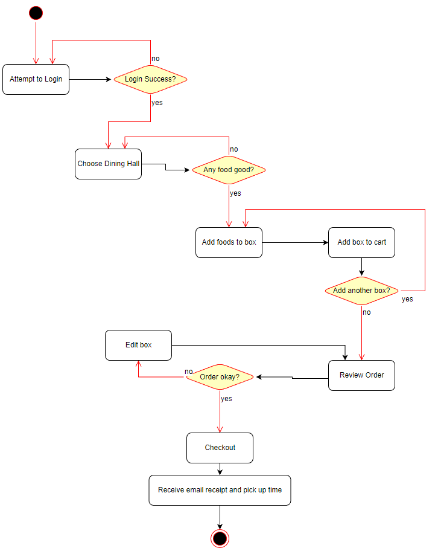
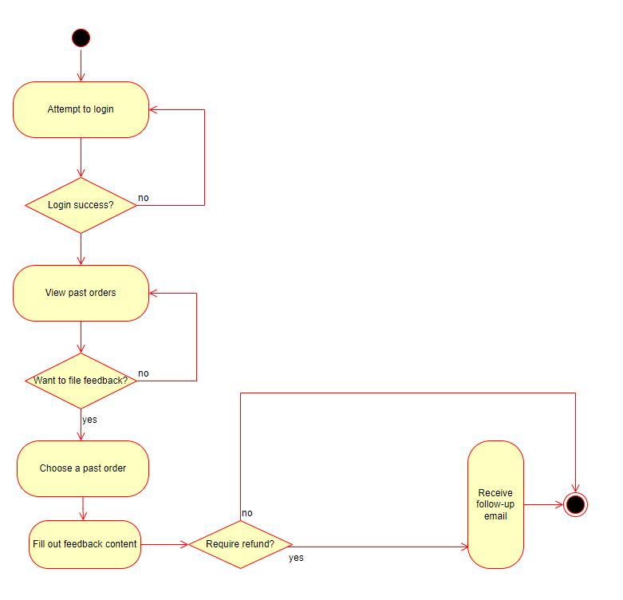

# Specification Phase Exercise

A little exercise to get started with the specification phase of the software development lifecycle. See the [instructions](instructions.md) for more detail.

## Team members

Winston Zhang - https://github.com/Midas0231
Adam Sidibe - https://github.com/sidibee
Alejandro Olazabal - https://github.com/aleolazabal
John Kolibachuk - https://github.com/jkolib

## Stakeholders

See instructions. Delete this line and replace with the name(s) of the stakeholder(s) you interviewed and lists showing their goals/needs, and problems/frustrations.

## Product Vision Statement

A mobile dining app designed for NYU students and staff to order and pickup food and drinks from any buffet-style dining halls on campus.

## User Requirements

1. As the business, I want to be able to easily update the menu throughout the week so that I can offer students a wide variety of meals.
2. As a student, I want to be able to see my pick up time so that I can better plan my day out.
3. As a student, I want to be able to order from any buffet-style dining hall near me so that I don't have to waste time traveling.
4. As a student, I want to be able to see future meals so that I can plan my diet.
5. As a student, I want to be able see the active menu at all dining halls to that I can better choose what I want to eat and see what is currently available.
6. As the business, I want to be able to track order volumes so that I can better see demand and supply and plan better meals that attract more customers.
7. As a student, I want to be able to report incorrect orders so that I can get a refund.
8. As the business, I want to be able to handle incorrect order reports so that I can provide refunds to students.
9. As a student, I want to be able to order ahead so that I can reduce my time spent waiting.
10. As a student, I want to be able order multiple meals at once so that I can get food for my friend.

## Activity Diagrams

